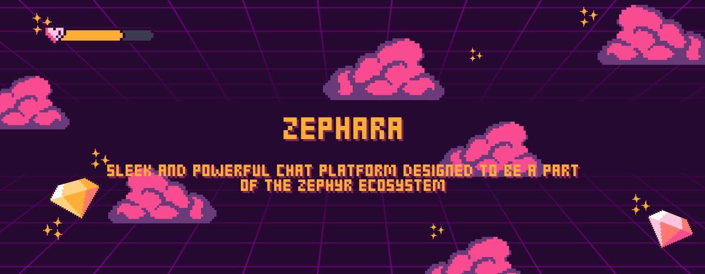

  
  

 

--- 

#### _
// Project Overview
_

<strong>Zephara or Zephyr Chat</strong> is the sleek and powerful chat platform designed to be a part of the Zephyr ecosystem—a social media aggregator. Built to foster real-time, seamless communication, offers an unparalleled chat experience.

> [!NOTE]
> Zephara is a part of the Zephyr ecosystem and is designed to be used in conjunction with zephyr as a chat platform.

#### _
// Analytics
_

#### _
// License
_

<strong>Zephara</strong> is licensed under the <a href="https://github.com/parazeeknova/velastria/blob/main/LICENSE">AGPL License</a>.

---
